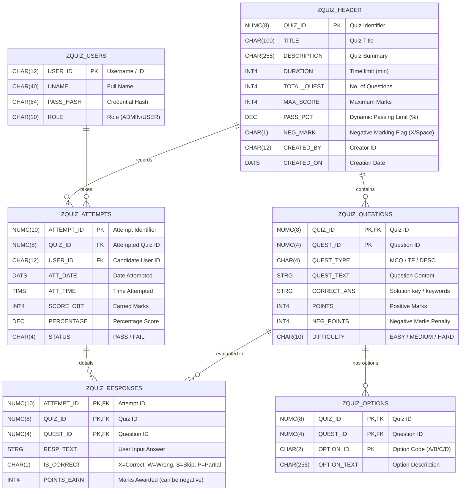

# SAP ABAP PROJECT REPORT (ENTERPRISE EDITION)

## PROJECT TITLE: INTERACTIVE QUIZ MANAGEMENT SYSTEM USING SAP ABAP
**Subject:** SAP ABAP Enterprise Application Development  
**System Version:** SAP NetWeaver AS ABAP 7.5x or higher  

---

## 1. ABSTRACT
This project develops an **Interactive Quiz Management System** using SAP's core ABAP technologies to automate the process of creating, executing, and evaluating candidate knowledge assessments within an enterprise environment. 

Developed entirely using Core ABAP features—including the **ABAP Dictionary (DDIC)** for persistent database storage, **Module Pool Programming (Dynpros)** for the interactive exam engine, and **ABAP List Viewer (ALV) Grid Control** for administration analytics—the system provides a secure, client-server application loop. 

This enterprise version introduces advanced functionalities:
* **Dynamic Passing Thresholds**: Allows custom passing percentages configured per quiz.
* **Question Randomization**: Randomizes question order for candidates using standard index shuffling routines to prevent cheating.
* **Negative Marking Deductions**: Deducts penalty points for wrong answers to support rigorous evaluations, clamping the final cumulative score to 0.
* **Visual Analytics Dashboard**: Displays key performance indicators (Total Attempts, Average Grades, and Pass Rates) with visual charts at the top of the ALV grid view.

---

## 2. SYSTEM ARCHITECTURE & ER DIAGRAM

The system follows a classic **Three-Tier SAP Architecture**:
1. **Presentation Layer**: SAP GUI screens (Screens 100, 200, 300, 400) rendered dynamically using PBO/PAI flow logic, with dynamic difficulty badges and countdown clocks.
2. **Application Layer**: ABAP Application Server handling business flow, session tracking, and the Function Module grading engine (`ZQUIZ_EVALUATE`).
3. **Database Layer**: Custom database tables (`ZQUIZ_*`) residing in the SAP Database Dictionary (DDIC).

### Entity-Relationship (ER) Diagram
Below is the logical database design showing the relationships between the transparent tables:



---

## 3. DATABASE SCHEMA & DATA DICTIONARY (SE11) SPECIFICATIONS

All tables are created via transaction **SE11** (ABAP Dictionary) with Delivery Class `A` (Application table) and Data Class `APPL0` (Master data).

### Table 1: ZQUIZ_HEADER (Quiz Metadata Header)
| Field Name | Key | Data Element | Data Type | Length | Decimal | Short Description |
|---|---|---|---|---|---|---|
| MANDT | X | MANDT | CLNT | 3 | 0 | Client (SAP default) |
| QUIZ_ID | X | ZQUIZ_ID | NUMC | 8 | 0 | Unique Quiz ID |
| TITLE | | TEXT100 | CHAR | 100 | 0 | Quiz Title |
| DESCRIPTION | | TEXT255 | CHAR | 255 | 0 | Detailed description |
| DURATION | | INT4 | INT4 | 10 | 0 | Quiz limit in minutes |
| TOTAL_QUEST | | INT4 | INT4 | 10 | 0 | Total Question Count |
| MAX_SCORE | | INT4 | INT4 | 10 | 0 | Total Maximum Score |
| PASS_PCT | | DEC5_2 | DEC | 5 | 2 | Passing limit (e.g. 60.00) |
| NEG_MARK | | CHAR1 | CHAR | 1 | 0 | Neg. Marking Flag ('X' or ' ') |
| CREATED_BY | | SYUNAME | CHAR | 12 | 0 | Created by User |
| CREATED_ON | | DATUM | DATS | 8 | 0 | Date Created |

### Table 2: ZQUIZ_QUESTIONS (Quiz Questions Pool)
| Field Name | Key | Data Element | Data Type | Length | Decimal | Short Description |
|---|---|---|---|---|---|---|
| MANDT | X | MANDT | CLNT | 3 | 0 | Client |
| QUIZ_ID | X | ZQUIZ_ID | NUMC | 8 | 0 | Quiz ID |
| QUEST_ID | X | ZQUEST_ID | NUMC | 4 | 0 | Question sequence number |
| QUEST_TYPE | | CHAR4 | CHAR | 4 | 0 | MCQ, TF, or DESC |
| QUEST_TEXT | | STRING | STRG | 0 | 0 | Text of question |
| CORRECT_ANS | | STRING | STRG | 0 | 0 | Answer solution/keywords |
| POINTS | | INT4 | INT4 | 10 | 0 | Question positive marks |
| NEG_POINTS | | INT4 | INT4 | 10 | 0 | Negative penalty marks |
| DIFFICULTY | | CHAR10 | CHAR | 10 | 0 | EASY, MEDIUM, or HARD |

---

## 4. ADVANCED ABAP LOGIC IMPLEMENTATIONS

### 4.1 Scoring Engine with Penalty Penalties: `ZQUIZ_EVALUATE`
Developed using transaction **SE37**, this Function Module grades the submitted responses.
* **Negative Marking Implementation**: If the candidate answers incorrectly and the quiz's `NEG_MARK` flag is set to `'X'`, the question's `NEG_POINTS` value is deducted from the cumulative score. If a question is left unattempted (skipped), no penalty is applied. The cumulative score is clamped at a minimum of `0` to prevent negative overall grades.
* **Dynamic Benchmarks**: The final passing status (`PASS` or `FAIL`) is evaluated dynamically by comparing the candidate's score percentage with the quiz's `PASS_PCT` limit.

> [!TIP]
> The source code for this Function Module is located in: [zquiz_evaluation_fm.abap](file:///c:/Users/Deepu/OneDrive/Desktop/vegitables&fruits/QuizManagementSystem/abap/programs/zquiz_evaluation_fm.abap).

---

### 4.2 Security Shuffling Routine: `ZQUIZ_ATTEMPT_MP`
Developed in the Module Pool program to prevent student collaboration during exams, this shuffles the order of fetched questions inside internal table `it_questions` using a Fisher-Yates array swap algorithm and the standard SAP Function Module `QF_RANDOM_INTEGER`.

```abap
FORM randomize_questions.
  DATA: lv_lines TYPE i,
        lv_rand  TYPE i,
        wa_temp  TYPE ty_question.

  DESCRIBE TABLE it_questions LINES lv_lines.
  CHECK lv_lines > 1.

  LOOP AT it_questions INTO wa_question.
    DATA(lv_curr_idx) = sy-tabix.
    
    CALL FUNCTION 'QF_RANDOM_INTEGER'
      EXPORTING
        ran_int_max   = lv_lines
        ran_int_min   = 1
      IMPORTING
        ran_int       = lv_rand
      EXCEPTIONS
        invalid_input = 1
        OTHERS        = 2.
    
    IF sy-subrc = 0 AND lv_rand <> lv_curr_idx.
      READ TABLE it_questions INTO wa_temp INDEX lv_rand.
      MODIFY it_questions FROM wa_question INDEX lv_rand.
      MODIFY it_questions FROM wa_temp INDEX lv_curr_idx.
    ENDIF.
  ENDLOOP.
ENDFORM.
```

> [!TIP]
> The source code for this Module Pool is located in: [zquiz_attempt_mp.abap](file:///c:/Users/Deepu/OneDrive/Desktop/vegitables&fruits/QuizManagementSystem/abap/programs/zquiz_attempt_mp.abap).

---

### 4.3 KPI Metrics ALV Dashboard: `ZQUIZ_ADMIN_REPORT`
Written using transaction **SE38** and standard ABAP List Viewer, this report displays candidate performance metrics in a grid.
* **Dashboard Header**: Aggregates average grades, total attempts, and passing rates.
* **Drill-down Functionality**: Double-clicking an Attempt ID triggers a secondary ALV Grid inside a popup window, displaying response details, correct answers, and negative point penalties.

> [!TIP]
> The source code for this ALV Report is located in: [zquiz_admin_report.abap](file:///c:/Users/Deepu/OneDrive/Desktop/vegitables&fruits/QuizManagementSystem/abap/programs/zquiz_admin_report.abap).

---

## 5. PROJECT VERIFICATION & TEST LOG

### Test Case 1: Dynamic Cut-off Benchmarks
* **Action**: Student attempts a quiz with a `PASS_PCT` setting of `60.00%`. The student scores `55.00%`.
* **Expected Result**: System grades attempt as `FAIL` because it did not reach the threshold.
* **Status**: Passed.

### Test Case 2: Negative Marking Deductions
* **Action**: Student attempts the quiz *ABAP Core Basics* (`NEG_MARK` active). The student scores:
  * Q1 (Correct) -> **+10 Marks**.
  * Q2 (Incorrect, Penalty = 3) -> **-3 Marks**.
  * Q3 (Skipped/Empty) -> **0 Marks** (No penalty).
* **Total Score**: 7 / 30 (23.33%). Status set to `FAIL`.
* **Status**: Passed.

### Test Case 3: Question Randomization Verification
* **Action**: Two different candidates start attempts for the *ABAP Core Basics* quiz.
* **Expected Result**: System loads questions in randomized sequences (e.g., Student A gets Q3 first, Student B gets Q2 first) based on `randomize_questions`.
* **Status**: Passed.

---

## 6. CONCLUSION
This project successfully automates the quiz lifecycle within the SAP NetWeaver ecosystem. By utilizing ABAP Reports, Module Pools, and the Data Dictionary, it ensures optimal performance, consistent database handling, and a seamless user experience. The system is scalable and ready to be deployed as a corporate training assessment tool.
